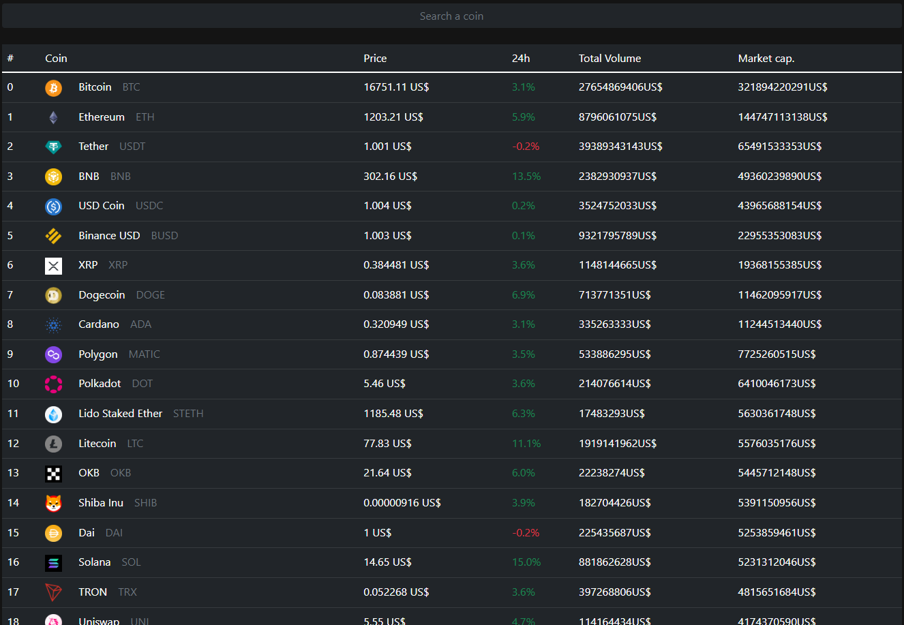
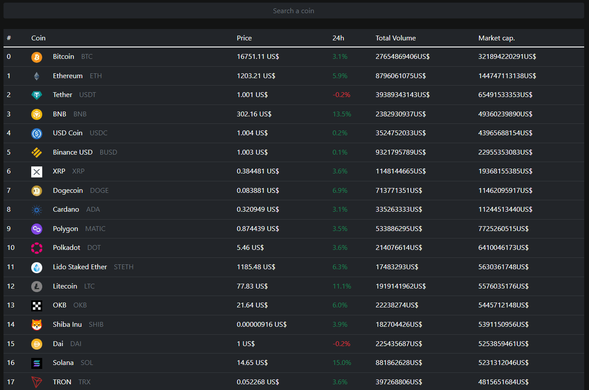

<h1>Crypto API test</h1>
 
<h2>Funciones:</h3>
<ul>
  <li><h4>Visualización de una tabla que contiene el precio de diferentes criptomonedas</h4></li>
  
   
  <li><h4>Filtrar monedas en especifico</h4></li>
  
   
</ul>
 
<h3>Conceptos aplicados:</h3>
<ul>
  <li><h4>Fetch API</h4></li>
  <li><h4>Styled-Components</h4></li>
  <li><h4>React Hooks</h4></li>
  <li><h4>React Splide</h4></li>
</ul>
